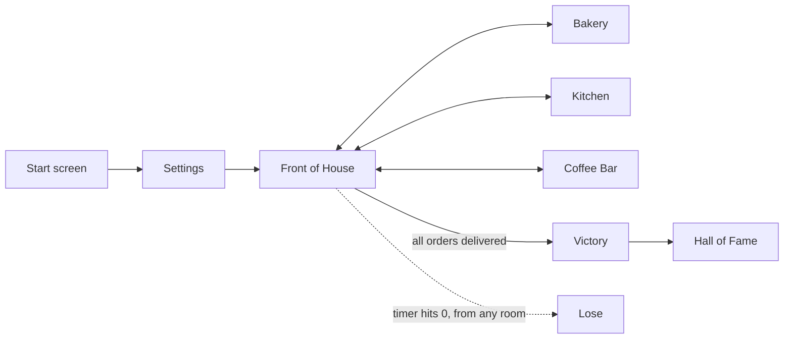

# Brew & Queue ☕ (Mario Café Rush)

A browser game about beating the clock, built with Python and Flask. You are the only barista, cook and baker at Café Byte during the breakfast rush. Take orders at the counter, run between the bakery, kitchen and coffee bar to collect the right items, and deliver every order before time runs out.

---

## How to play

1. Click **Click to Play**. **View Rules** shows the rules first.
2. On the **Settings** page, set the number of orders, the order size, the time limit and your name, then confirm.
3. At the **Front of House**, click **New Order**. The order appears on the board.
4. Go to the stations and pick up the items:

   | Station | Items |
   |---|---|
   | Bakery | plain / filled croissant, untoasted / toasted bread |
   | Kitchen | scrambled / boiled / omelette egg, soft / crispy bacon |
   | Coffee Bar | espresso. While you're at the bar you can turn it into a latte, americano, cortado or cappuccino |

5. Go back to the Front of House and click **Deliver**. Your tray has to match the order exactly, with nothing missing and nothing extra. If you grabbed the wrong item, drop it at the station you took it from.
6. You win by delivering the target number of orders before the timer reaches zero, and your run is saved to the **Hall of Fame**. If the timer runs out first, you lose.

Turn your sound on, because the game has music and sound effects. To start over at any point, use **Restart Game** at the bottom of the page.

---

## Run it locally

**You need:** Python 3.11+ and git.

```bash
git clone https://github.com/laddhadhruv/mario_cafe_rush.git
cd mario_cafe_rush

python3 -m venv venv
source venv/bin/activate          # Windows: venv\Scripts\activate

pip install -r requirements.txt
python main.py
```

Then open **http://127.0.0.1:8080** in your browser.

> **Windows:** run `mkdir C:\tmp` once before you start. The game saves its settings and Hall of Fame to a `/tmp` folder, and Windows doesn't have one by default.

---

## Configuration

The default settings are in `config.json`. The first time the app runs, it copies `config.json` and `hall_of_fame.csv` into `/tmp`, and from then on it reads and saves both there. Changes made on the Settings page (`/settings`) go to `/tmp/config.json` and leave the copy in the repo untouched. To change the defaults, edit `config.json` and delete `/tmp/config.json`.

| Key | What it controls |
|---|---|
| `orders_to_win` | Number of orders you must deliver to win |
| `order_size.min` / `order_size.max` | Every order has a random number of items in this range (max must be greater than min) |
| `time_limit` | Seconds you get for the whole game |
| `player_name` | Name shown on the board and in the Hall of Fame |

---

## Deploy it

### Option A: any Python host (Render, Railway, a VPS)

| Setting | Value |
|---|---|
| Build command | `pip install -r requirements.txt` |
| Start command | `gunicorn -b 0.0.0.0:$PORT main:app` |

Run a single worker, which is gunicorn's default (see *Known limitations*).

### Option B: Google App Engine (`app.yaml` included)

Install the [gcloud CLI](https://cloud.google.com/sdk/docs/install), then run:
```bash
gcloud init              # choose or create a project
gcloud app create        # first time only
gcloud app deploy
gcloud app browse
```

`.gcloudignore` controls which files are left out of the upload.

---

## How the code works

The game runs on a small engine borrowed from text adventures, built from **rooms, items and actions**. Each page is a *room*. The buttons you see are *actions*, which come from the room you're in and from the items you're carrying.



**What happens when you click something:**

1. `main.py` maps each URL to a room class. For example, `/kitchen` maps to `rooms/kitchen.py`.
2. `core/basehandler.py` loads the game state from the session and builds the list of available actions (`core/menu.py`). It then runs the action you clicked, saves the state and redirects you.
3. `templates/room.html` draws the room.

**Where state lives:**

- **Game state** (rooms, your tray, the current order): the server-side session, via Flask-Session with file storage.
- **Countdown timer and music**: your browser, using `localStorage` in `templates/base.html`. When the timer reaches zero, the browser sends you to `/lose`.
- **Settings**: `/tmp/config.json`, copied from `config.json` on first run.
- **Winning runs**: appended to `/tmp/hall_of_fame.csv` and shown at `/halloffame`.

### Project layout

```
main.py             Flask app: routes, settings page, win logging, hall of fame
config.json         Default game settings
hall_of_fame.csv    Starting Hall of Fame data
app.yaml            Google App Engine config
.gcloudignore       Files to skip when deploying to App Engine
requirements.txt    Python dependencies

core/               The reusable engine: Game, Room, Item, Action, Player, Menu, request handlers
rooms/              The café: startingpoint, frontofhouse (orders + delivery), bakery, kitchen, coffeebar, victory_room
items/              orderable_items.py (food and drinks), espresso.py (espresso + drink-making actions)
templates/          HTML pages (room.html renders every room)
static/             Images, audio, CSS
```

These files are left over from the starter adventure template and the café game doesn't use them: `items/keys.py`, `lamp.py`, `oilcan.py`, `treasure.py`, `forms/shirtchoice.py`, `templates/coffeebar.html`, `shirtchoice.html` and `victory_room.html`. `cafe_byte.html` is an early standalone mockup and isn't part of the Flask app either.

### Adding your own content

- **New menu item:** subclass `Item` in `items/` and give it an id, a description and a `section` (the station where it can be dropped). Add it to a station's inventory in that room's `__init__`. To make it show up in orders, also add it to `possible_items` in `rooms/frontofhouse.py`.
- **New station:** subclass `Room` in `rooms/` and give it navigation actions (actions with `get_destination()`). Add a route in `main.py` with `registerHandler(...)` and a banner image at `static/images/<room_id>_bg.png`.

---

## Known limitations

- **One game per server.** The game object is cached in a module-level variable (`_cur_game` in `core/support.py`), so everyone who plays on the same server shares one game. That's fine for playing locally or giving a demo, but it doesn't work for a public site with many players at once.
- **Settings are global.** Saving on `/settings` changes the settings for every player on that server.
- **Saved data is temporary.** Settings and the Hall of Fame live in `/tmp`, so they're wiped when the computer restarts, when the app is redeployed, or when App Engine starts a new instance.
- **Secret key.** `app.secret_key` is hard-coded in `main.py`. Change it, or load it from an environment variable, before you deploy publicly.

---

## License

GPL-3.0. See [LICENSE](LICENSE).
